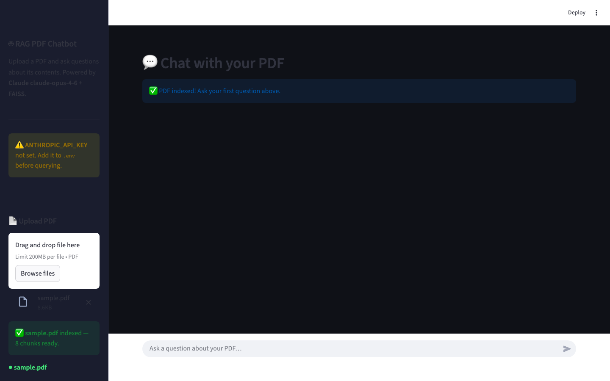

# DocMind — PDF Intelligence

**Author:** Jayanshu Badlani
**GitHub:** [JAYANSHUBADLANI](https://github.com/JAYANSHUBADLANI)
**LinkedIn:** [jayanshu-badlani](https://linkedin.com/in/jayanshu-badlani)

---

## Overview

I built this to scratch a personal itch — being able to drop any PDF and interrogate it in plain English rather than ctrl-F-ing through 80 pages. It uses Claude Opus for the answers, FAISS for vector search, and local sentence-transformer embeddings (no extra API key needed for indexing).

The UI is a dark-mode Streamlit app that shows the answer alongside the exact passages it retrieved, with page numbers, so you can verify the source yourself.

---

## Screenshot



---

## Features

| Feature | Detail |
|---------|--------|
| PDF Upload | Drag-and-drop, any PDF |
| Semantic Search | FAISS + sentence-transformers embeddings |
| Claude Opus LLM | Grounded, citation-aware answers |
| Source Transparency | Every answer shows retrieved passages + page numbers |
| Persistent Index | FAISS saved to disk — no re-indexing on reload |

---

## Tech Stack

| Component | Technology |
|-----------|-----------|
| LLM | Claude Opus (Anthropic) |
| Orchestration | LangChain LCEL |
| Embeddings | `sentence-transformers/all-MiniLM-L6-v2` |
| Vector Store | FAISS (CPU) |
| PDF Parsing | PyPDFLoader |
| UI | Streamlit |

---

## Repository Structure

```
rag-pdf-chatbot/
│
├── src/
│   ├── __init__.py
│   ├── pdf_processor.py       # PDF loading, cleaning & chunking
│   ├── vectorstore.py         # FAISS build/save/load
│   └── rag_chain.py           # LangChain RAG pipeline (LCEL)
│
├── app.py                     # Streamlit UI
│
├── assets/
│   ├── sample.pdf             # 8-page RAG overview — good demo doc
│   └── screenshot.png
│
├── data/                      # Drop your PDFs here (git-ignored)
├── vectorstore/               # FAISS index lives here (git-ignored)
│
├── .env.example
├── .gitignore
├── requirements.txt
└── README.md
```

---

## Setup

### 1. Clone
```bash
git clone https://github.com/JAYANSHUBADLANI/rag-pdf-chatbot.git
cd rag-pdf-chatbot
```

### 2. Virtual environment
```bash
python -m venv .venv
source .venv/bin/activate        # macOS / Linux
# .venv\Scripts\activate         # Windows
```

### 3. Install dependencies
```bash
pip install -r requirements.txt
```

### 4. Add your API key
```bash
cp .env.example .env
```
Open `.env` and fill in your Anthropic API key:
```env
ANTHROPIC_API_KEY=sk-ant-...
```
Get one at [console.anthropic.com](https://console.anthropic.com).

---

## Run

```bash
streamlit run app.py
```

Opens at **http://localhost:8501**.

1. Upload a PDF in the sidebar (or try `assets/sample.pdf`)
2. Wait a few seconds for indexing
3. Ask questions in the chat input
4. Expand **Sources** under any answer to see the retrieved passages

---

## Deploy to Streamlit Cloud

1. Push to GitHub
2. Go to [share.streamlit.io](https://share.streamlit.io) → New app
3. Set repo to `JAYANSHUBADLANI/rag-pdf-chatbot`, branch `main`, main file `app.py`
4. Under **Advanced settings → Secrets**, add:
   ```toml
   ANTHROPIC_API_KEY = "sk-ant-..."
   ```
5. Deploy — live URL in ~2 minutes

> The FAISS index is rebuilt automatically on each new upload, so the free-tier filesystem reset is not an issue.

---

## License

MIT — free to use and adapt with attribution.
