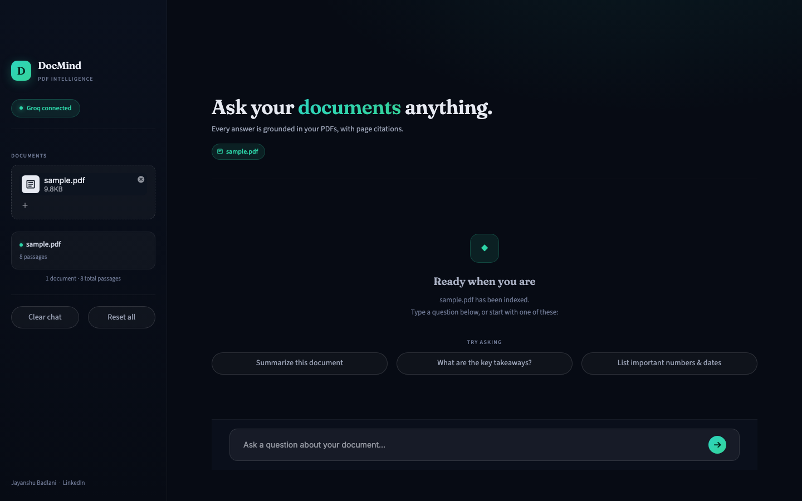

# DocMind: PDF Intelligence

[](https://github.com/JAYANSHUBADLANI/rag-pdf-chatbot/actions/workflows/tests.yml)

**Author:** Jayanshu Badlani
**GitHub:** [JAYANSHUBADLANI](https://github.com/JAYANSHUBADLANI)
**LinkedIn:** [jayanshu-badlani](https://www.linkedin.com/in/jayanshu-badlani-b77478185/)

---

## Overview

I built this to scratch a personal itch: being able to drop any PDF (or a stack of them) and interrogate it in plain English rather than ctrl-F-ing through 80 pages. It uses Llama 3.3 70B (served free and fast via Groq) for the answers, FAISS for vector search, and local sentence-transformer embeddings (no extra API key needed for indexing).

The UI is a dark-mode Streamlit app that shows the answer alongside the exact passages it retrieved, with page numbers, so you can verify the source yourself.

A few things I added later because the basic version got annoying to use:

- **Streaming responses** so the answer starts appearing immediately instead of staring at a spinner for 8 seconds.
- **Conversation memory** so follow-ups like "okay but what about the deployment part?" actually work. The app rewrites the question using the prior turn before searching.
- **Cross-encoder reranking** on top of vector search. Vector similarity gets you in the right neighbourhood; the reranker picks the chunks that actually answer the question. Big difference on long documents.
- **Multi-PDF support**: drop several PDFs and ask across them. Citations show which file each passage came from.

---

## Screenshot



---

## Features

| Feature | Detail |
|---------|--------|
| PDF Upload | Drag-and-drop, multiple files at once |
| Semantic Search | FAISS + sentence-transformers embeddings |
| Reranking | Cross-encoder (`ms-marco-MiniLM-L-6-v2`) on top of vector retrieval |
| Llama 3.3 70B LLM | Grounded, citation-aware answers, streamed token by token |
| Conversation Memory | Follow-ups rewritten with Llama 3.1 8B before retrieval |
| Source Transparency | Every answer shows retrieved passages + page numbers + file name |
| Persistent Index | FAISS saved to disk, no re-indexing on reload |

---

## Tech Stack

| Component | Technology |
|-----------|-----------|
| Answer LLM | Llama 3.3 70B Versatile (Groq) |
| Query rewriter | Llama 3.1 8B Instant (Groq) |
| Orchestration | LangChain LCEL |
| Embeddings | `sentence-transformers/all-MiniLM-L6-v2` |
| Reranker | `cross-encoder/ms-marco-MiniLM-L-6-v2` |
| Vector Store | FAISS (CPU) |
| PDF Parsing | PyPDFLoader |
| UI | Streamlit |

---

## Measured retrieval quality

I didn't want to just claim the two-stage retrieval works, so I evaluated this exact stack (MiniLM embeddings, 12 candidates reranked by the ms-marco cross-encoder, top 5 kept) with my [rag-evaluation-framework](https://github.com/JAYANSHUBADLANI/rag-evaluation-framework): bootstrap confidence intervals on every metric, paired permutation tests on every comparison.

The honest headline from its 20-document / 40-question benchmark: document-level retrieval saturates (Recall@5 = 1.0 for dense retrieval with or without reranking), and the permutation test finds **no significant gain from the reranker on that corpus** (answer relevance p = 0.63). Well-separated topics simply don't need a cross-encoder. The stage stays in DocMind because real-world PDFs are the hard case it exists for, long documents where many chunks are near-duplicates and vector similarity alone ranks them poorly, and because measuring that claim is exactly what the eval framework is for. Full numbers live in the framework repo's [case study](https://github.com/JAYANSHUBADLANI/rag-evaluation-framework#case-study-measuring-a-production-retrieval-stack).

---

## Repository Structure

```
rag-pdf-chatbot/
│
├── src/
│   ├── __init__.py
│   ├── pdf_processor.py       # PDF loading, cleaning & chunking
│   ├── vectorstore.py         # FAISS build/save/load
│   └── rag_chain.py           # LangChain RAG pipeline (LCEL)
│
├── app.py                     # Streamlit UI
│
├── scripts/
│   └── generate_sample_pdf.py # Regenerates assets/sample.pdf
│
├── tests/
│   ├── conftest.py            # Offline stand-ins: embeddings, reranker, LLMs
│   ├── test_pdf_processor.py  # Cleaning, chunking, page labels
│   ├── test_vectorstore.py    # Build, add, save/load roundtrip
│   └── test_rag_chain.py      # Prompts, citations, reranking, streaming
│
├── assets/
│   ├── sample.pdf             # 8-page RAG overview, good demo doc
│   └── screenshot.png
│
├── data/                      # Drop your PDFs here (git-ignored)
├── vectorstore/               # FAISS index lives here (git-ignored)
│
├── .env.example
├── .gitignore
├── pytest.ini
├── requirements.txt
└── README.md
```

---

## Setup

### 1. Clone
```bash
git clone https://github.com/JAYANSHUBADLANI/rag-pdf-chatbot.git
cd rag-pdf-chatbot
```

### 2. Virtual environment
```bash
python -m venv .venv
source .venv/bin/activate        # macOS / Linux
# .venv\Scripts\activate         # Windows
```

### 3. Install dependencies
```bash
pip install -r requirements.txt
```

### 4. Add your API key
```bash
cp .env.example .env
```
Open `.env` and fill in your Groq API key:
```env
GROQ_API_KEY=gsk_...
```
Get one for free at [console.groq.com](https://console.groq.com), no credit card required.

---

## Run

```bash
streamlit run app.py
```

Opens at **http://localhost:8501**.

1. Upload a PDF in the sidebar (or try `assets/sample.pdf`)
2. Wait a few seconds for indexing
3. Ask questions in the chat input
4. Expand **Sources** under any answer to see the retrieved passages

---

## Tests

```bash
pip install pytest
pytest
```

51 tests covering text cleaning, chunk indexing, the FAISS save/load roundtrip,
citation dedup across multiple PDFs, cross-encoder ordering, and the streaming
contract (a sources event, then tokens).

The suite runs offline. No Groq key, no model downloads, no network: the
embedding model, the cross-encoder and both LLMs are swapped for deterministic
stand-ins in `tests/conftest.py`. So a fresh clone can run `pytest` before it
has a key, and the tests never cost an API call or fail because a hub download
timed out.

Two things are deliberately not covered: the Streamlit UI in `app.py`, and
whether Groq actually returns a sensible answer. The first needs a browser
driver, the second is a property of the model rather than of this code. What
retrieval quality this stack achieves is measured separately, in the
[evaluation framework](https://github.com/JAYANSHUBADLANI/rag-evaluation-framework).

---

## Deploy to Streamlit Cloud

1. Push to GitHub
2. Go to [share.streamlit.io](https://share.streamlit.io) → New app
3. Set repo to `JAYANSHUBADLANI/rag-pdf-chatbot`, branch `main`, main file `app.py`
4. Under **Advanced settings → Secrets**, add:
   ```toml
   GROQ_API_KEY = "gsk_..."
   ```
5. Deploy, live URL in ~2 minutes

> The FAISS index is rebuilt automatically on each new upload, so the free-tier filesystem reset is not an issue.

---

## License

MIT license, free to use and adapt with attribution.
